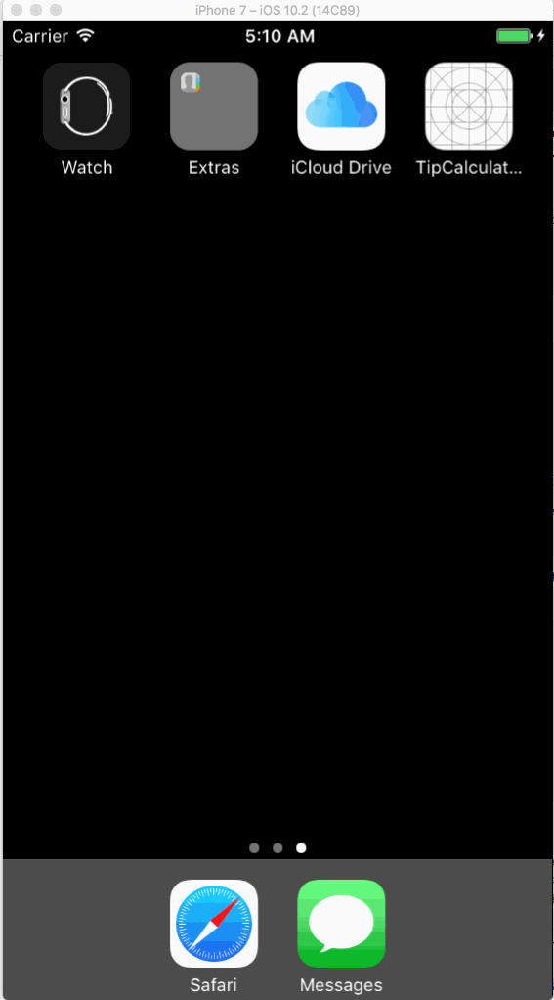

# Tip Calculator
> A Localized(Chinese/English) Tip Calculator
> An animation in first screen to allow user input amount and click it, calculator will shown.
> Default 3 percentage 15%, 18%, 20%, you can update default percentage by using setting

